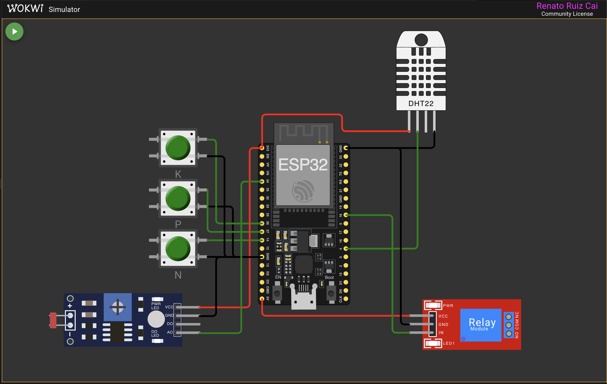

# FIAP - Faculdade de Informática e Administração Paulista

 

# Agro Sensors Vinhedo

## 📜 Descrição

*Este projeto consiste no desenvolvimento de um sistema de irrigação inteligente para a cultura da uva, utilizando um ESP32 e simulações no ambiente Wokwi.*

*A solução integra diferentes fontes de dados, incluindo sensores simulados (umidade do solo, pH e nutrientes NPK), previsão climática obtida via API externa e um modelo estatístico desenvolvido em R. A partir dessas informações, o sistema é capaz de tomar decisões automatizadas sobre o acionamento da irrigação, considerando tanto regras determinísticas quanto uma camada probabilística baseada em regressão logística.*

*Além disso, o projeto permite a interação em tempo real via monitor serial, possibilitando a simulação de diferentes cenários para validação do comportamento do sistema.*

## 📁 Estrutura de pastas

Dentre os arquivos e pastas presentes na raiz do projeto, definem-se:

- <b>scripts</b>: Contém os scripts responsáveis pela integração com dados externos e pelo processamento estatístico do sistema.
   - <code>weather_api.py</code>: realiza a chamada à API OpenWeather para obtenção da previsão de chuva e converte os dados em um formato simplificado para o sistema.
   - <code>generate_weather_header.py</code>: executa a integração com a API e gera um arquivo header em C++ com os dados climáticos para uso no firmware.
   - <code>irrigation_training_data.csv</code>: base de dados simulada utilizada para treinamento do modelo estatístico em R.
   - <code>irrigation_model.R</code>: implementa o modelo de regressão logística responsável por calcular a probabilidade de irrigação com base nas variáveis agrícolas.
   - <code>generate_irrigation_model_header.py</code>: executa o modelo em R e gera um arquivo header em C++ com o resultado da análise estatística.

- <b>src</b>: Contém todo o código fonte da aplicação embarcada no ESP32, organizado de forma modular:
   - <code>main.ino</code>: ponto de entrada do sistema, responsável pela orquestração das leituras, decisões e exibição dos dados no monitor serial.
   - <code>sensor_readings.cpp/.h</code>: realiza a leitura dos sensores simulados (botões NPK, LDR e DHT22).
   - <code>irrigation_logic.cpp/.h</code>: contém a lógica de decisão da irrigação, combinando regras determinísticas e o modelo estatístico.
   - <code>serial_logger.cpp/.h</code>: responsável pela exibição estruturada das informações no monitor serial.
   - <code>weather_input.cpp/.h</code>: gerencia os dados de previsão de chuva, incluindo integração com o header gerado e override manual via Serial.
   - <code>r_model_input.cpp/.h</code>: gerencia os dados do modelo estatístico em R, permitindo leitura do resultado gerado e override manual em tempo de execução.
   - <code>constants.h</code>: centraliza constantes do sistema, como limites de pH, umidade e parâmetros de decisão.
   - <code>pins.h</code>: define o mapeamento dos pinos utilizados no ESP32.
   - <code>generated_weather_data.h</code>: arquivo gerado automaticamente no build com os dados da previsão do tempo.
   - <code>generated_irrigation_model_data.h</code>: arquivo gerado automaticamente no build com o resultado do modelo estatístico.

- <b>platformio.ini</b>: Arquivo de configuração do PlatformIO, responsável por definir o ambiente de build, dependências e execução dos scripts de pré-processamento.

- <b>diagram.json</b>: Define a configuração do circuito no Wokwi, incluindo ESP32, botões, sensores e conexões.

- <b>README.md</b>: Arquivo que apresenta uma visão geral do projeto, incluindo sua finalidade, estrutura e instruções de uso.

## 🔌 Arquitetura do Circuito

A simulação do circuito foi realizada utilizando a plataforma Wokwi, com integração dos seguintes componentes:

- ESP32
- Sensor DHT22 (umidade e temperatura)
- Sensor LDR (simulação de pH)
- Botões (simulação de nutrientes NPK)
- Módulo Relé (bomba de irrigação)

### Representação do circuito

  

  <i>Figura 1 — Diagrama do circuito simulado no Wokwi</i>

## 🔧 Como executar o código

*Pré Requisitos:*

*Git - Utilizado para clonar o repositório do projeto.*

*Visual Studio Code (VS Code)*

*Extensões: R, PlatformIO e Wokwi Simulator* 

*Se necessário instalar os certificados SSL do Python*

*Garantir que tenha as instalações necessárias das linguagens R., C/C++ e Python*

*Fase 1 — Clonar o repositório:*

*No terminal, execute: git clone git@github.com:renatoruiz2607/fiapCursoTecIA.git*

*Em seguida, faça o trajeto até a pasta principal:*

*cd fiapCursoTecIA*

*cd fase2*

*cd cap1*

*cd fiapAgroSensorsVinhedo*

*Fase 2 — Preparar a chave do OpenWeather*

*O projeto utiliza a API OpenWeather para obtenção da previsão de chuva.*

*Para isso, é necessário definir a variável de ambiente com sua API Key.*

*No terminal, execute export OPENWEATHER_API_KEY="SUA_CHAVE_AQUI"*

*Para validar se a variável foi configurada corretamente: echo $OPENWEATHER_API_KEY*

*Fase 3 — Executar a aplicação*

*O build deve ser executado no mesmo terminal onde a chave foi configurada.*

*Execute o comando: ~/.platformio/penv/bin/pio run*

*Abra a extensão Wokwi Simulator*

*Clique em Start Simulation*

*Abra o Serial Monitor para visualizar os logs do sistema*

*Fase 4 - Funcionamento*

*O sistema permite simular diferentes cenários em tempo real via entrada no terminal:*

*Previsão de chuva: 1 → chuva prevista (irrigação bloqueada) / 0 → sem chuva* 

*Modelo estatístico (R): r1 → força decisão de irrigar / r0 → força decisão de não irrigar / ra → retorna ao modo automático (resultado do modelo em R)* 

*O sistema também permite simular diferentes cenários em tempo real via alteração dos níveis de umidade do solo e pH, a partir dos componentes no simulador Wokwi (diagram.json)*

## 🧠 Lógica de Decisão de Irrigação

O sistema de irrigação foi desenvolvido com base na combinação de três abordagens:

- **Regras determinísticas** (baseadas em conhecimento agronômico da cultura da uva)
- **Análise climática via API (OpenWeather)**
- **Modelo estatístico (regressão logística em R)**

A decisão final de irrigação considera todas essas camadas de forma integrada.

### 🌧️ Análise Climática (OpenWeather)

O sistema utiliza a API OpenWeather para avaliar a previsão de chuva nas próximas horas.

A irrigação é bloqueada quando são identificadas condições relevantes de precipitação, considerando simultaneamente:

- **Probabilidade de chuva (POP) ≥ 60%**
- **Volume de chuva previsto ≥ 2.0 mm**

Ou seja:

`Chuva relevante = POP ≥ 0.6 E Volume ≥ 2.0 mm`

### 🌱 Regras Determinísticas

A irrigação só é permitida quando **todas as condições abaixo são atendidas**:

- **Ausência de chuva prevista**  
  A irrigação é bloqueada caso a análise climática identifique chuva suficiente.

- **Umidade do solo abaixo do limite mínimo**  
  O solo deve estar com umidade inferior ao valor configurado para permitir irrigação.

- **pH do solo dentro da faixa ideal para a cultura da uva**  
  A irrigação só ocorre quando o pH está dentro do intervalo adequado (aproximadamente entre 5.5 e 6.5).

- **Presença de Potássio (K)**  
  O potássio é considerado um nutriente essencial para a cultura, sendo obrigatório para permitir irrigação.

- **Quantidade mínima de nutrientes ativos (NPK)**  
  É necessário que pelo menos dois nutrientes estejam em níveis adequados.

### 📊 Modelo Estatístico (R)

Além das regras determinísticas, o sistema utiliza um modelo de **regressão logística** desenvolvido em R, que calcula a probabilidade de necessidade de irrigação com base nas seguintes variáveis:

- Umidade do solo
- pH do solo
- Quantidade de nutrientes ativos
- Presença de potássio
- Previsão de chuva

O modelo retorna:

- **Probabilidade de irrigação**
- **Decisão binária**:
  - `1` → irrigar
  - `0` → não irrigar

### ⚙️ Regra Final de Decisão

A decisão final do sistema segue a seguinte lógica:

Irrigar SE:
- Não houver chuva relevante (API)
E
- Regras determinísticas forem atendidas
E
- Modelo estatístico recomendar irrigação

## 🎥 Vídeo demonstrativo

▶️ [Assistir no YouTube](https://www.youtube.com/watch?v=AXcdfUI0DlU)

## 🗃 Histórico de lançamentos

* 1.0.0 - 16/04/2026
    * 
* 0.6.0 - 16/04/2026
    * 
* 0.5.0 - 16/04/2026
    * 
* 0.4.0 - 16/04/2026
    * 
* 0.3.0 - 15/04/2026
    * 
* 0.2.0 - 15/04/2026
    * 
* 0.1.0 - 15/04/2026
    *

## 📋 Licença

<a property="dct:title" rel="cc:attributionURL" href="https://github.com/agodoi/template">MODELO GIT FIAP</a> por <a rel="cc:attributionURL dct:creator" property="cc:attributionName" href="https://fiap.com.br">Fiap</a> está licenciado sobre <a href="http://creativecommons.org/licenses/by/4.0/?ref=chooser-v1" target="_blank" rel="license noopener noreferrer" style="display:inline-block;">Attribution 4.0 International</a>.

