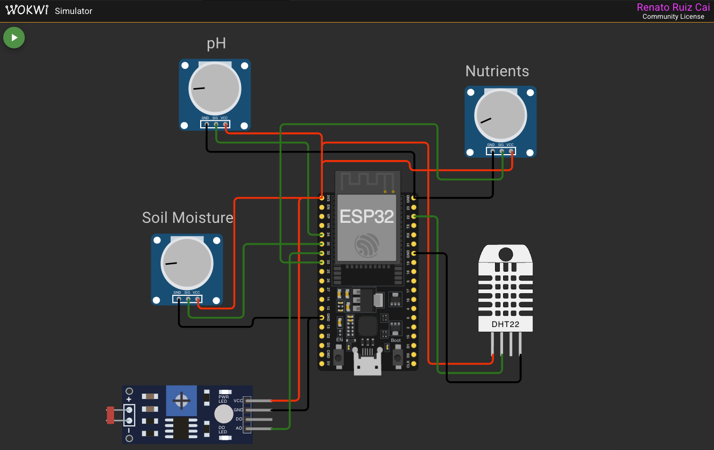
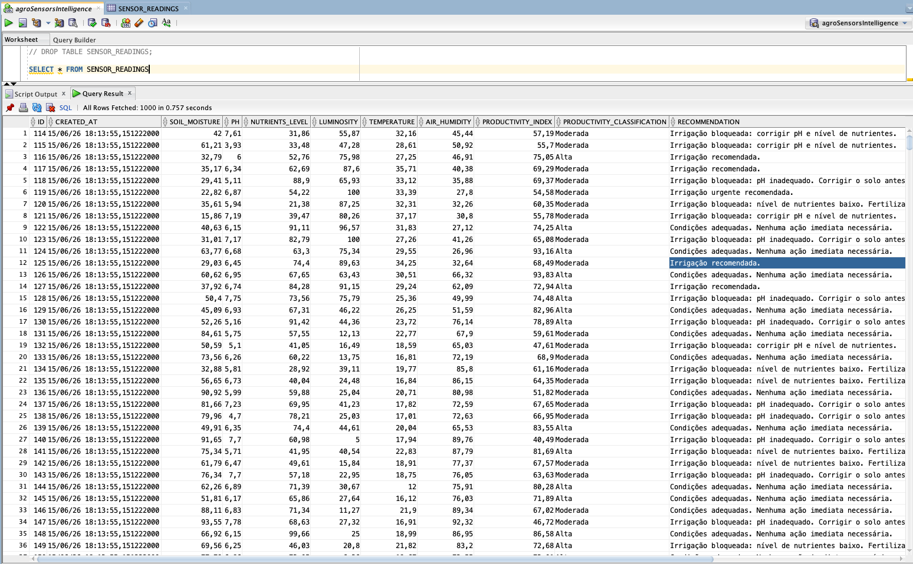
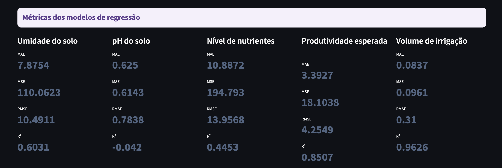
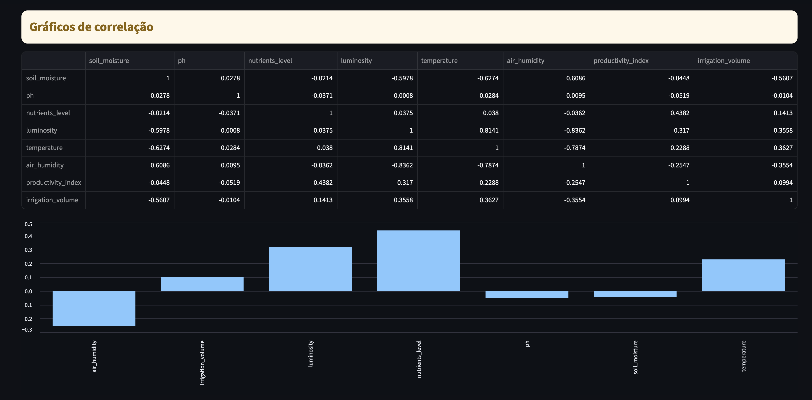
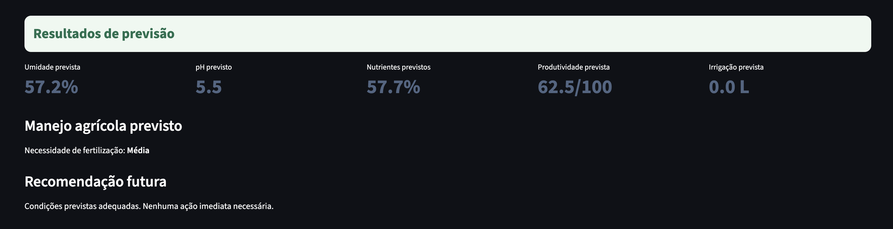
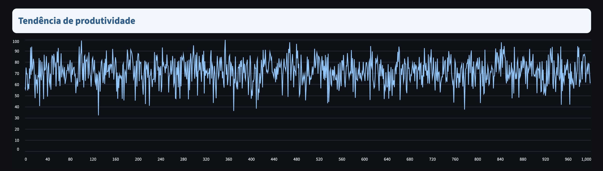

# FIAP - Faculdade de Informática e Administração Paulista

<p align="center">
<a href= "https://www.fiap.com.br/"></a>
</p>

<br>

# Agro Sensors Intelligence

## Grupo

## 👨‍🎓 Integrantes: 
- <a href="https://www.linkedin.com/in/renatoruizcai">Renato Ruiz Cai</a>


## 👩‍🏫 Professores:
### Tutor(a) 
- <a href="https://www.linkedin.com/in/sabrina-otoni-22525519b/">Sabrina Otoni</a>
### Coordenador(a)
- <a href="https://www.linkedin.com/in/andregodoichiovato">André Godoi Chiovato</a>


## 📜 Descrição

*O AgroSensorsIntelligence é um protótipo de Assistente Agrícola Inteligente desenvolvido para transformar dados agrícolas em informações estratégicas para apoio à tomada de decisão no campo.*

*A solução realiza o monitoramento de variáveis críticas da lavoura, como umidade do solo, pH, nível de nutrientes, luminosidade, temperatura e umidade do ar, permitindo o acompanhamento contínuo das condições de cultivo.*

*Com base no histórico de dados coletados, o sistema gera previsões sobre indicadores agrícolas relevantes, incluindo umidade do solo, pH, nível de nutrientes, produtividade esperada e necessidade de irrigação. A partir dessas previsões, são apresentadas recomendações de irrigação e manejo agrícola, auxiliando na identificação de ações que podem contribuir para melhores condições de cultivo.*

*O projeto também disponibiliza uma visão analítica dos dados, permitindo acompanhar métricas de desempenho dos modelos preditivos, identificar correlações entre variáveis agrícolas, visualizar tendências de produtividade e interpretar os resultados das previsões de forma simples e acessível.*

*O objetivo da solução é demonstrar como dados agrícolas podem ser utilizados para apoiar decisões mais inteligentes, contribuindo para uma gestão agrícola mais eficiente, sustentável e orientada por dados.*


## 📁 Estrutura de pastas

Dentre os arquivos e pastas presentes na raiz do projeto, definem-se:

- <b>assets</b>: Pasta destinada ao armazenamento de imagens, diagramas, capturas de tela e demais recursos visuais utilizados na documentação e apresentação do projeto.

- <b>data</b>: Contém os arquivos de dados utilizados pela solução.
   - <code>simulated_sensor_readings.csv</code>: dataset simulado utilizado para popular o banco de dados com registros históricos para treinamento e validação dos modelos de Machine Learning.

- <b>dashboard</b>: Contém a aplicação analítica desenvolvida para visualização dos dados e resultados do projeto.
   - <code>app.py</code>: dashboard interativo responsável pela exibição de métricas, correlações, previsões agrícolas e tendências de produtividade.

- <b>database</b>: Contém os módulos responsáveis pela conexão e manipulação do banco de dados Oracle.
   - <code>database.py</code>: realiza a conexão com o banco de dados e inicialização da estrutura necessária para a aplicação.
   - <code>sensor_reading_repository.py</code>: centraliza as operações de consulta e persistência das leituras agrícolas armazenadas.
 
- <b>ml</b>: Contém os componentes relacionados ao treinamento, avaliação e execução dos modelos de Machine Learning.
   - <code>dataset_builder.py</code>: realiza a extração e preparação dos dados armazenados no banco para utilização nos modelos preditivos.
   - <code>train_models.py</code>: responsável pelo treinamento dos modelos de regressão, cálculo das métricas de desempenho e geração dos artefatos necessários para previsões futuras.
   - <code>prediction_service.py</code>: executa previsões agrícolas utilizando os modelos previamente treinados e gera recomendações de irrigação e manejo agrícola.
   - <code>trained_models</code>: diretório utilizado para armazenamento local dos modelos treinados gerados durante a execução da aplicação.
 
- <b>services</b>: Contém os serviços auxiliares utilizados pela aplicação.
   - <code>automatic_ingestion_service.py</code>: realiza a ingestão automática e periódica das leituras dos sensores para o banco de dados.
   - <code>csv_import_service.py</code>: realiza a importação de datasets simulados para popular a base histórica utilizada pelos modelos preditivos.
   - <code>dashboard_launcher.py</code>: responsável por iniciar automaticamente o dashboard Streamlit a partir do menu principal da aplicação.

- <b>include</b>: Contém os arquivos de cabeçalho da aplicação embarcada, responsáveis pelas definições de estruturas, funções e contratos utilizados pelo projeto.
   - <code>pins.h</code>: define o mapeamento dos pinos utilizados pelos sensores conectados ao ESP32.
   - <code>sensor_readings.h</code>: define as estruturas e funções responsáveis pela leitura dos sensores agrícolas.
   - <code>productivity_engine.h</code>: define as funções responsáveis pelo cálculo do índice de produtividade esperada.
   - <code>recommendation_engine.h</code>: define as regras utilizadas para geração das recomendações agrícolas.
   - <code>serial_logger.h</code>: define as funções responsáveis pela exibição estruturada das informações no monitor serial.

- <b>src</b>: Contém o código fonte da solução, incluindo a aplicação embarcada no ESP32 e a aplicação Python.
   - <code>main.ino</code>: ponto de entrada da aplicação embarcada no ESP32, responsável pela leitura dos sensores agrícolas simulados.
   - <code>sensor_readings.cpp</code>: realiza a leitura, conversão e formatação dos dados provenientes dos sensores.
   - <code>productivity_engine.cpp</code>: calcula o índice de produtividade esperada com base nos indicadores agrícolas coletados.
   - <code>recommendation_engine.cpp</code>: executa as regras de negócio responsáveis pelas recomendações locais de irrigação e manejo agrícola.
   - <code>serial_logger.cpp</code>: responsável pela exibição estruturada das leituras no monitor serial.
   - <code>main.py</code>: ponto de entrada da aplicação Python responsável pela inicialização do banco de dados e carregamento do menu principal.
   - <code>menu.py</code>: implementa o menu interativo utilizado para consulta dos sensores, persistência dos dados, treinamento dos modelos, execução das previsões e abertura do dashboard.

- <b>.env</b>: arquivo local utilizado para armazenamento das credenciais de acesso ao banco de dados Oracle.

- <b>.env.example</b>: modelo de configuração das variáveis de ambiente necessárias para utilização das integrações externas.

- <b>requirements.txt</b>: lista as dependências Python necessárias para execução completa da aplicação.

- <b>platformio.ini</b>: arquivo de configuração do PlatformIO, responsável por definir o ambiente de build, dependências e execução da aplicação embarcada.

- <b>diagram.json</b>: Define a configuração do circuito no Wokwi, incluindo ESP32, sensores e conexões.

- <b>wokwi.toml</b>: arquivo de configuração da integração entre PlatformIO e simulador Wokwi.

- <b>README.md</b>: Arquivo que apresenta uma visão geral do projeto, incluindo sua finalidade, estrutura e instruções de uso.


## 🔌 Representação do circuito

<p align="center">
  
</p>

<p align="center">
  <i>Figura 1 — Diagrama do circuito simulado no Wokwi</i>
</p>


## 📎 Links e Observações

- <b>Listagem de Links</b>: Links do projeto (ex. vídeos da entrega, páginas, etc.),
   - Vídeo demonstrativo: [Assistir no YouTube](https://youtu.be/lNG4tYj-Chc)

- <b>Explicação de decisões técnicas</b>:
   - Para o MVP, as previsões e recomendações agrícolas utilizam exclusivamente os dados coletados pelos sensores locais, sem integração com APIs meteorológicas. Essa decisão permitiu concentrar o desenvolvimento na coleta, armazenamento, treinamento dos modelos de Machine Learning e geração de previsões dentro do escopo da atividade.
   - Para simplificar a simulação dos dados agrícolas no ambiente Wokwi, foram utilizados potenciômetros para representar algumas variáveis do campo, como umidade do solo, pH e nível de nutrientes. Essa abordagem permitiu gerar valores controlados e compatíveis com as regras do projeto, mantendo o foco principal da atividade na integração dos dados, construção dos modelos preditivos e desenvolvimento do dashboard analítico.
   - O índice de produtividade esperada foi desenvolvido como um indicador agronômico composto, calculado a partir da combinação de fatores considerados relevantes para o desenvolvimento da lavoura, como umidade do solo, pH, luminosidade e nível de nutrientes. Esse índice foi utilizado tanto para análises quanto para treinamento dos modelos preditivos.
   - Para aumentar a quantidade de registros disponíveis para treinamento dos modelos de Machine Learning, foi adotada a importação opcional de um dataset simulado contendo dados agrícolas historicamente consistentes. Essa estratégia permitiu trabalhar com uma base mais robusta, melhorando a qualidade das previsões geradas pelos modelos.
   - O banco de dados é utilizado como repositório central da solução. Todas as leituras dos sensores são armazenadas juntamente com os indicadores calculados pelo sistema, como produtividade esperada e volume de irrigação recomendado, formando o histórico utilizado pelos modelos preditivos.
   - As previsões agrícolas são realizadas utilizando a leitura mais recente registrada no banco de dados como cenário atual. Dessa forma, o fluxo adotado pela solução consiste em: coleta dos sensores, cálculo dos indicadores agrícolas, persistência dos dados no banco e execução das previsões a partir do histórico armazenado. Quando a ingestão automática está ativa, as previsões passam a refletir continuamente os dados mais recentes coletados pelo sistema.
   - O volume de irrigação previsto foi modelado como um problema de regressão, permitindo que o sistema estime quantitativamente a necessidade de irrigação a partir das condições agrícolas observadas. Essa abordagem possibilita gerar recomendações mais precisas do que uma simples decisão binária de irrigar ou não irrigar.
   - A necessidade de fertilização foi representada por meio de classificações qualitativas (Baixa, Média e Alta), facilitando a interpretação dos resultados pelos usuários e permitindo a geração de recomendações de manejo agrícola mais intuitivas.
   - Os modelos de Machine Learning foram desenvolvidos utilizando aprendizado supervisionado de regressão para prever variáveis críticas do campo, incluindo umidade do solo, pH, nível de nutrientes, produtividade esperada e volume de irrigação. O desempenho dos modelos é avaliado por meio das métricas MAE, MSE, RMSE e R², permitindo analisar a qualidade das previsões geradas.
   - O dashboard analítico foi desenvolvido para consolidar os dados históricos, métricas dos modelos, correlações entre variáveis agrícolas, tendências de produtividade e previsões geradas pelo sistema, oferecendo uma visão integrada das informações utilizadas na tomada de decisão agrícola.


## 🔧 Como executar o código

***Pré Requisitos:***

*Git - Utilizado para clonar o repositório do projeto.*

*Visual Studio Code (VS Code)*

*Extensões: PlatformIO, Wokwi Simulator, pyserial, python-dotenv, oracledb, pandas, scikit-learn, joblib, numpy e streamlit*

*Se necessário instalar os certificados SSL do Python*

*Garantir que tenha as instalações necessárias das linguagens C/C++ e Python*

*Criar um projeto no Oracle*

*Configurar as variáveis de ambiente do Oracle no arquivo .env*

*Instalar as dependências Python com `pip install -r requirements.txt`*

***Fase 1 — Clonar o repositório:***

*No terminal, execute: git clone `git@github.com:renatoruiz2607/fiapCursoTecIA.git`*

*Em seguida, faça o trajeto até a pasta principal:*

*cd fiapCursoTecIA*

*cd fase4*

*cd cap1*

*cd fiapAgroSensorsIntelligence*

*Crie e configure o arquivo .env com as informações de .env.example*

***Fase 2 — Executar a aplicação***

*Abra a extensão PlatformIO*

*Execute o build*

*Abra a extensão Wokwi Simulator*

*Clique em Start Simulation*

*No terminal python, execute `python3 src/main.py`*

***Fase 3 - Funcionamento***

*O sistema permite, pelo menu interativo:*

- *exibir leitura atual dos sensores*
- *exibir produtividade esperada*
- *exibir recomendação agrícola*
- *salvar leitura atual no banco de dados*
- *iniciar ingestão automática dos dados no banco de dados*
- *exibir status da ingestão automática*
- *parar ingestão automática*
- *importar CSV simulado para o banco de dados*
- *treinar modelos de Machine Learning*
- *executar previsão agrícola*
- *abrir dashboard Streamlit*
- *encerrar a aplicação*

*O sistema também permite simular diferentes cenários em tempo real via alteração dos níveis dos sensores, a partir dos componentes no simulador Wokwi (diagram.json)*

## 🧠 Lógica de Análise Agrícola

*A análise agrícola é responsável por interpretar os dados coletados pelos sensores, calcular indicadores agronômicos, gerar recomendações de manejo e alimentar os modelos de Machine Learning utilizados nas previsões do sistema.*

### Cálculo do Índice de Produtividade Esperada

*O índice de produtividade esperada representa uma estimativa simplificada do potencial produtivo da lavoura, calculada a partir de quatro fatores principais:*

- *umidade do solo;*
- *pH do solo;*
- *luminosidade;*
- *nível de nutrientes.*

*Cada variável recebe um score agronômico entre 0 e 100, representando o quanto sua condição atual favorece o desenvolvimento da cultura.*

*Fórmula aplicada:*

*`productivity_index = (soil_moisture_score + ph_score + luminosity_score + nutrients_score) / 4`*

*O resultado final é limitado entre 0 e 100.*

### Scores Agronômicos

*Os scores agronômicos são calculados com base em faixas consideradas adequadas para o desenvolvimento da lavoura.*

***Umidade do Solo:***

- *81% a 90% → Score 70;*
- *60% a 80% → Score 100;*
- *45% a 59% → Score 75;*
- *30% a 44% → Score 45;*
- *Abaixo de 30% → Score 20;*
- *Acima de 90% → Score 30.*

***pH do Solo:***

- *5.5 a 7.0 → Score 100;*
- *5.0 a 5.4 ou 7.1 a 7.5 → Score 70;*
- *4.5 a 4.9 ou 7.6 a 8.0 → Score 40;*
- *Demais valores → Score 20.*

***Luminosidade:***

- *Acima de 95% → Score 55;*
- *86% a 95% → Score 70;*
- *50% a 85% → Score 100;*
- *35% a 49% → Score 75;*
- *20% a 34% → Score 45;*
- *Abaixo de 20% → Score 20.*

***Nível de Nutrientes***

*O nível de nutrientes já é utilizado diretamente como score, variando de 0 a 100.*

### Recomendações Agrícolas

*A recomendação agrícola utiliza regras de negócio para evitar ações que possam prejudicar ainda mais as condições da lavoura.*

***Bloqueio de Irrigação***

- *o pH está fora da faixa adequada (5.5 a 7.0);*
- *o nível de nutrientes está abaixo de 50%.*

*Nesses cenários, o sistema recomenda corrigir o solo antes da irrigação.*

***Recomendação de Irrigação***

- *Umidade abaixo de 25% → Irrigação urgente;*
- *Umidade entre 25% e 40% → Irrigação recomendada;*
- *Temperatura elevada e baixa umidade do ar → Irrigação preventiva;*
- *Demais cenários → Nenhuma ação imediata necessária.*

***Volume de Irrigação***

*O volume de irrigação representa uma estimativa simplificada da quantidade de água necessária para o solo.*

- *Umidade abaixo de 25% → 8 litros;*
- *Umidade entre 25% e 40% → 5 litros;*
- *Umidade entre 40% e 55% → 2 litros;*
- *Acima de 55% → 0 litros.*

*Caso o pH esteja inadequado ou o nível de nutrientes esteja abaixo do mínimo recomendado, o volume de irrigação é automaticamente definido como 0 litros.*

***Necessidade de Fertilização***

*A necessidade de fertilização é determinada com base no nível de nutrientes identificado ou previsto pelo sistema.*

- *Nutrientes acima de 80% → Baixa*
- *Nutrientes entre 50% e 79% → Média*
- *Nutrientes abaixo de 50% → Alta*

## 🤖 Machine Learning

### Pipeline de Treinamento

*Os modelos utilizam um pipeline completo de Machine Learning para garantir que os dados sejam tratados adequadamente antes do treinamento.*

*O pipeline executa as seguintes etapas:*

- *tratamento de valores ausentes utilizando imputação pela média;*
- *padronização dos dados numéricos;*
- *treinamento do modelo de regressão.*

*Essa abordagem garante que todas as etapas de preparação dos dados sejam aplicadas de forma consistente durante o treinamento e durante a execução das previsões.*

### Modelos Preditivos

Foram implementados modelos supervisionados de regressão para previsão das seguintes variáveis agrícolas:

- *umidade do solo;*
- *pH do solo;*
- *nível de nutrientes;*
- *produtividade esperada;*
- *volume de irrigação.*

### Métricas de Avaliação

*O desempenho dos modelos é avaliado por meio das seguintes métricas:*

***MAE (Mean Absolute Error)***

*Representa o erro absoluto médio entre os valores previstos e os valores reais. Quanto menor o resultado, maior a precisão do modelo.*

***MSE (Mean Squared Error)***

*Calcula a média dos erros elevados ao quadrado, penalizando previsões com erros mais elevados.*

***RMSE (Root Mean Squared Error)***

*Representa a raiz quadrada do MSE e permite interpretar o erro médio utilizando a mesma unidade da variável prevista.*

***R² (Coeficiente de Determinação)***

*Indica o quanto o modelo consegue explicar a variação dos dados observados.*

- *Próximo de 1 → excelente capacidade preditiva;*
- *Próximo de 0 → baixa capacidade preditiva;*
- *Abaixo de 0 → desempenho inferior a uma previsão baseada apenas na média dos dados.*

### Execução das Previsões

*As previsões utilizam o histórico armazenado no banco de dados para treinamento dos modelos e a leitura mais recente registrada como cenário atual.*

*Os resultados representam um cenário agrícola estimado com base nos padrões aprendidos pelo modelo durante o treinamento, servindo como apoio à tomada de decisão relacionada à irrigação e ao manejo agrícola.*

## 🗄️ Integração com Banco de Dados Oracle

*A integração com o banco de dados Oracle foi implementada para permitir o armazenamento persistente das leituras agrícolas coletadas pela aplicação, criando uma base histórica utilizada nas análises e previsões do sistema.*

*Cada registro armazenado contém informações como umidade do solo, pH, nível de nutrientes, luminosidade, temperatura, umidade do ar, índice de produtividade esperada, volume de irrigação recomendado, necessidade de fertilização e recomendações geradas pelo sistema.*

*Ao iniciar a aplicação, o sistema verifica automaticamente a existência da tabela principal utilizada pelo projeto. Caso a estrutura ainda não exista, a tabela é criada automaticamente, simplificando a configuração inicial do ambiente.*

*A tabela utilizada é:*

- *sensor_readings: responsável pelo armazenamento das leituras agrícolas e indicadores calculados pela aplicação.*

*Os dados podem ser enviados ao banco de três formas:*

- *salvamento manual da leitura atual dos sensores;*
- *ingestão automática em intervalos periódicos configurados pela aplicação;*
- *importação de um dataset simulado em CSV para popular a base histórica utilizada nos treinamentos de Machine Learning.*

*O banco de dados é utilizado como repositório central da solução, concentrando tanto os dados coletados pelos sensores quanto os indicadores derivados das regras de negócio implementadas pelo sistema.*

*As variáveis necessárias para conexão com o banco Oracle são configuradas no arquivo <code>.env</code>:*

```env
ORACLE_USER=seu_usuario
ORACLE_PASSWORD=sua_senha
ORACLE_DSN=oracle_dsn
```

<p align="center">
  
</p>

<p align="center">
  <i>Figura 2 — Banco de Dados Oracle</i>
</p>

## 📊 Dashboard Analítico

*O dashboard analítico foi desenvolvido para consolidar as informações armazenadas no banco de dados e apresentar indicadores, análises e previsões agrícolas de forma visual e intuitiva.*

*A interface permite acompanhar as principais variáveis monitoradas pela solução, incluindo umidade do solo, pH, nível de nutrientes, luminosidade, temperatura, umidade do ar, produtividade esperada e volume de irrigação recomendado.*

*Além da visualização dos dados históricos, o dashboard também apresenta os resultados gerados pelos modelos de Machine Learning*

*O dataset simulado utilizado durante o desenvolvimento do projeto (*`simulated_sensor_readings.csv`*) também está disponível no repositório. Dessa forma, avaliadores e demais usuários podem importar a mesma base histórica utilizada pelos autores, reproduzindo o treinamento dos modelos, as métricas obtidas, as previsões geradas e todas as análises apresentadas no dashboard.*

### Métricas gerais da Base de Dados

<p align="center">
  
</p>
<p align="center"><i>Figura 3 — Métricas gerais da Base de Dados</i></p>

*A base histórica utilizada no projeto é composta por 1.000 registros agrícolas, contendo leituras dos sensores e indicadores calculados pelo sistema.*

*O dashboard exibe a média de dados críticos do solo.*

*O índice médio de produtividade esperada foi de 71,5/100, indicando que, de forma geral, os cenários presentes na base apresentam condições agrícolas favoráveis e potencial produtivo moderado a elevado.*

### Última leitura registrada

<p align="center">
  
</p>

<p align="center">
  <i>Figura 4 — Última leitura registrada</i>
</p>

*Em conjunto, a última leitura representa um cenário relativamente estável, porém com atenção para o pH levemente abaixo da faixa ideal e para a baixa luminosidade observada no momento da medição.*

### Métricas dos Modelos de Regressão

<p align="center">
  
</p>

<p align="center">
  <i>Figura 5 — Métricas dos Modelos de Regressão</i>
</p>

*Os modelos de regressão foram avaliados utilizando as métricas MAE, MSE, RMSE e R², permitindo medir o nível de precisão das previsões geradas para cada variável agrícola.*

****Volume de Irrigação***: O modelo de volume de irrigação apresentou o melhor desempenho entre todos os modelos treinados, alcançando R² de 0,9626. Esse resultado indica que o algoritmo conseguiu explicar aproximadamente 96% da variação observada nos dados, demonstrando elevada capacidade preditiva para estimar a necessidade de irrigação.*

****Produtividade Esperada***: O modelo de produtividade esperada também apresentou excelente desempenho, com R² de 0,8507. Como o índice de produtividade é calculado a partir de variáveis diretamente monitoradas pelo sistema, o modelo conseguiu identificar com precisão os padrões que influenciam o potencial produtivo da lavoura.*

****Umidade do Solo***: O modelo de previsão da umidade do solo obteve R² de 0,6031, indicando capacidade preditiva satisfatória. O resultado demonstra que existe relação consistente entre a umidade do solo e as demais variáveis monitoradas, permitindo estimativas razoáveis para apoio à tomada de decisão.*

****Nível de Nutrientes***: O modelo de nutrientes apresentou R² de 0,4453, considerado moderado. Esse comportamento era esperado, pois a disponibilidade de nutrientes possui menor correlação direta com parte das demais variáveis presentes na base de treinamento, tornando sua previsão mais desafiadora.*

****pH do Solo***: O modelo de pH apresentou R² de -0,042, indicando baixo poder preditivo. Esse resultado ocorre porque o pH foi gerado de forma praticamente independente das demais variáveis da base simulada, reduzindo a capacidade do algoritmo de identificar padrões consistentes para previsão.*

*Os resultados demonstram que os modelos obtiveram melhor desempenho para variáveis diretamente relacionadas às regras agronômicas implementadas no projeto, como produtividade esperada e volume de irrigação. Por outro lado, variáveis com menor dependência das demais características da base, como o pH, apresentaram desempenho inferior.*

*Esse comportamento reforça um dos principais conceitos de Machine Learning: a qualidade das previsões depende diretamente da qualidade dos dados disponíveis e do grau de relação existente entre as variáveis utilizadas durante o treinamento.*

### Gráficos de correlação

<p align="center">
  
</p>

<p align="center">
  <i>Figura 6 — Gráficos de correlação</i>
</p>

***Correlação com a Produtividade Esperada***

*O gráfico destaca as variáveis que mais influenciam o índice de produtividade esperado calculado pelo sistema.*

****Nível de nutrientes (0,44)***: apresentou a maior correlação positiva com a produtividade, indicando que solos mais ricos em nutrientes tendem a gerar melhores índices produtivos.*

****Luminosidade (0,32)***: apresentou correlação positiva moderada, demonstrando a importância da incidência de luz para o desenvolvimento das culturas.*

****Temperatura (0,23)***: apresentou influência positiva mais discreta, contribuindo para o desempenho produtivo quando em faixas adequadas.*

****Umidade do ar (-0,25)***: apresentou correlação negativa moderada, sugerindo que níveis elevados de umidade atmosférica nem sempre estão associados aos melhores cenários produtivos presentes na base.*

****pH (-0,05) e umidade do solo (-0,04)***: apresentaram correlação muito baixa com a produtividade, indicando pouca influência direta dentro dos cenários simulados utilizados no projeto.*

***Relações Relevantes Identificadas***

*A matriz de correlação também permite observar alguns comportamentos coerentes com cenários agrícolas reais.*

*Luminosidade e temperatura apresentaram forte correlação positiva (0,81), indicando que períodos mais iluminados tendem a estar associados a temperaturas mais elevadas.*

*Luminosidade e umidade do ar apresentaram forte correlação negativa (-0,84), refletindo a tendência de redução da umidade relativa em períodos mais ensolarados.*

*Temperatura e umidade do ar também apresentaram correlação negativa significativa (-0,79), comportamento frequentemente observado em condições climáticas reais.*

*Umidade do solo e umidade do ar apresentaram correlação positiva (0,61), indicando que ambientes mais úmidos tendem a favorecer a manutenção da umidade no solo.*

*Os resultados demonstram que o nível de nutrientes foi o fator mais relevante para o índice de produtividade presente na base de dados, seguido pela luminosidade e temperatura. As correlações observadas reforçam a consistência dos cenários utilizados no projeto e ajudam a explicar o desempenho obtido pelos modelos de Machine Learning durante o treinamento.*

### Resultados de previsão

<p align="center">
  
</p>

<p align="center">
  <i>Figura 7 — Resultados de previsão</i>
</p>

*Esta seção apresenta as estimativas geradas pelos modelos de Machine Learning a partir da leitura mais recente registrada no banco de dados. O objetivo é demonstrar como os padrões aprendidos durante o treinamento podem ser utilizados para apoiar decisões futuras relacionadas à irrigação e ao manejo agrícola.*

****Manejo Agrícola***: Com base no nível de nutrientes estimado, o sistema classificou a necessidade de fertilização como Média. Isso indica que o solo apresenta condições aceitáveis para o cultivo, mas deve continuar sendo monitorado para evitar redução da disponibilidade nutricional ao longo do tempo.*

****Recomendação Futura***: Considerando conjuntamente as previsões de umidade, pH, nutrientes, produtividade e irrigação, o sistema concluiu que as condições futuras tendem a permanecer adequadas, não identificando a necessidade de ações corretivas imediatas.*

*Os resultados demonstram a aplicação prática dos modelos preditivos desenvolvidos no projeto. Em vez de apenas analisar o estado atual da lavoura, o sistema é capaz de estimar tendências futuras e fornecer suporte antecipado à tomada de decisão agrícola, objetivo central da proposta de Agricultura Cognitiva apresentada neste trabalho.*

### Tendência de produtividade

<p align="center">
  
</p>

<p align="center">
  <i>Figura 8 — Tendência de produtividade</i>
</p>

*O gráfico apresenta a variação do índice de produtividade esperado ao longo dos registros armazenados no banco de dados.*

*A maior parte dos registros concentra-se entre 60 e 85 pontos, próxima da média geral de 71,5/100, indicando predominância de condições agrícolas favoráveis.*


## 🗃 Histórico de lançamentos

* 1.0.0 - 16/06/2026
    *
* 0.8.0 - 15/06/2026
    * 
* 0.7.0 - 15/06/2026
    * 
* 0.6.0 - 15/06/2026
    * 
* 0.5.0 - 15/06/2026
    * 
* 0.4.0 - 14/06/2026
    * 
* 0.3.0 - 14/06/2026
    * 
* 0.2.0 - 14/06/2026
    * 
* 0.1.0 - 14/06/2026
    *

---


## 📋 Licença

<p xmlns:cc="http://creativecommons.org/ns#" xmlns:dct="http://purl.org/dc/terms/"><a property="dct:title" rel="cc:attributionURL" href="https://github.com/SabrinaOtoni/TEMPLATE-FIAP-GRAD-ON-IA">MODELO GIT FIAP</a> por <a rel="cc:attributionURL dct:creator" property="cc:attributionName" href="https://fiap.com.br">FIAP</a> está licenciado sobre <a href="http://creativecommons.org/licenses/by/4.0/?ref=chooser-v1" target="_blank" rel="license noopener noreferrer" style="display:inline-block;">Attribution 4.0 International</a>.</p>
